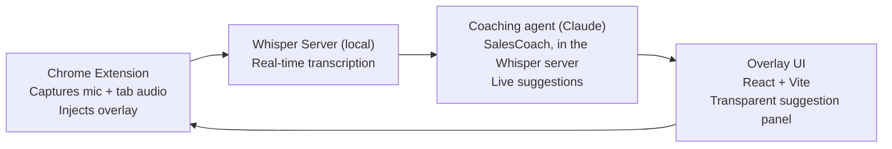

# StrategyLive

A real-time AI sales coach for Google Meet. It captures microphone and tab audio during a call, transcribes locally with Whisper (nothing leaves your machine), and delivers live coaching suggestions through a browser-extension overlay. An exploration of what AI can do in the moment, during a live conversation, not just in the recap afterward.

**Role:** Personal project (spec and build)
**Stack:** Python (local Whisper transcription, Claude agent), Chrome extension, React + Vite overlay

## What It Does

- **Local transcription.** A Whisper server transcribes call audio on your own machine. No audio is sent to a third-party service.
- **Live coaching.** A Claude-based sales agent reads the transcript as it forms and surfaces suggestions, questions to ask, and things to listen for, in real time.
- **Overlay UI.** Suggestions render in a lightweight, transparent overlay injected by a Chrome extension, so the coaching sits alongside the call without taking it over.

## Architecture

## Running it

1. Start the local server: `python whisper_server.py` (loads Whisper and listens on `ws://localhost:3003`).
2. Build the overlay: `npm install && npm run build:overlay`.
3. In Chrome, open `chrome://extensions`, enable Developer mode, and Load unpacked from `extension/`.
4. Join a Google Meet call and start capture from the extension popup.

## Docs

Design detail lives in [`docs/`](docs/): [architecture](docs/architecture.md), [audio capture](docs/audio.md), [conversation intelligence](docs/conversation.md), and the [roadmap](docs/product-roadmap.md).

---

More from Chris Eaton, VP of Product at LiveData: [chriseatonai.com](https://chriseatonai.com) &middot; [LinkedIn](https://www.linkedin.com/in/chris-eaton-ai/)
